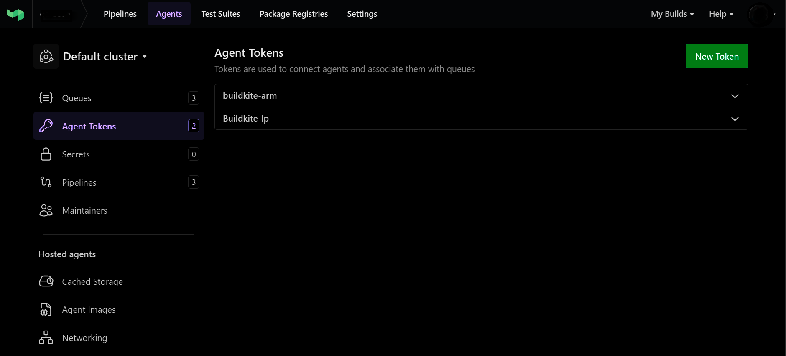
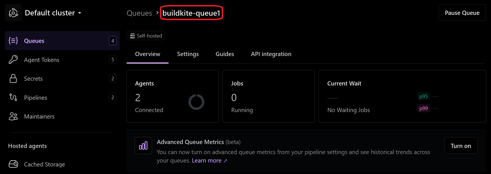
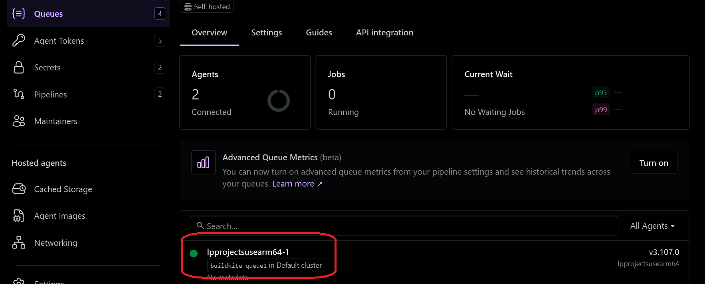

# Buildkite Agent Setup 
This guide describes the steps to configure a Buildkite agent and queue after installing the Buildkite agent binary on a SUSE ARM64 VM.

## 1. Create an Agent Token

Before configuring the agent, you need an agent token from your Buildkite organization.

1. Log in to your **Buildkite** account and go to your **Organization Settings**.  
2. Click **Agents** in the left menu.  
3. Click **Create Agent Token**.  
4. Enter a **name** for your token, e.g., `buildkite-arm`.  
5. Click **Create Token**.  
6. **Copy the token** immediately – you won’t be able to see it again after leaving the page.




## 2. Configure Buildkite Agent

Create the configuration directory and file on your loacal system:

```console
sudo tee /home/gcpuser/.buildkite-agent/buildkite-agent.cfg > /dev/null <<EOF
token="YOUR_AGENT_TOKEN"
tags="queue=buildkite-queue1"
EOF
```
- Replace `YOUR_AGENT_TOKEN` with the token you created.
- name is the human-readable agent name.
- tags defines the queue this agent will use (buildkite-queue).

Verify the configuration:

```console
cat /home/gcpuser/.buildkite-agent/buildkite-agent.cfg
```

## 3. Create a Queue in Buildkite

1. Go to your **Buildkite Organization → Queues → Create Queue**.  
2. Name it: `buildkite-queue1`.  
3. Save it.  

{}Make sure the queue name matches the `tags` field in the agent configuration.{}



## 4. Verify Agent in Buildkite UI

First, you need to run agent from the localy:

```console
sudo /home/gcpuser/.buildkite-agent/bin/buildkite-agent start
```

Then, Verify by UI
Go to **Buildkite → Agents.**

Confirm that the agent is online and connected to the queue buildkite-queue1.


