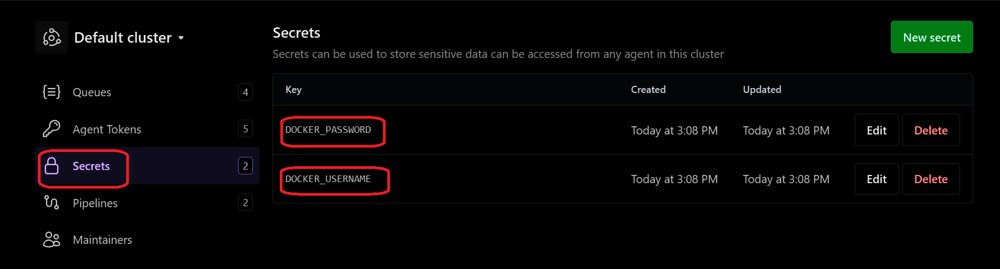

## Multi-Arch with Buildkite

After you have installed **Buildkite** and **Docker**, you can set up a simple Python microservice to test **multi-architecture builds**.

Make sure you have a GitHub repository ready where you can execute the upcoming steps, including creating the Dockerfile, app.py, and your pipeline.yml.

### Create Dockerfile

Inside your GitHub repo, add a file named `Dockerfile` with this content:

```dockerfile
FROM python:3.12-slim

WORKDIR /app

COPY app.py .

RUN pip install flask

EXPOSE 5000

CMD ["python", "app.py"]
```

### Create app.py

In the same repo, add a file named `app.py`:

```python
from flask import Flask
app = Flask(__name__)

@app.route('/')
def hello():
    return "Hello from Arm-based Buildkite runner!"

if __name__ == "__main__":
    app.run(host="0.0.0.0", port=5000)
```

### Push Repo to GitHub

Commit and push your repo with both `Dockerfile` and `app.py`.

### Add Deploy Key for Buildkite Agent

Generate SSH key for your agent user:

```console
ssh-keygen -t rsa -b 4096 -C "buildkite-agent" -f ~/.ssh/id_rsa
```
Add Deploy Key for Buildkite Agent

Copy the public key:

```console
cat ~/.ssh/id_rsa.pub
```
Now go to your GitHub repository:

1. Navigate to **Settings → Deploy Keys → Add Key**
2. Paste the copied public key
3. Enable **“Allow write access”**

This allows your Buildkite agent to securely pull from the repository.

### Create Buildkite Pipeline for Multiarch

In Buildkite, define your pipeline YAML (either in the repo as `pipeline.yml` or through the UI):

```yaml
steps:
  - label: "Build and Push Multiarch App"
    env:
      DOCKER_CONFIG: "~/.docker"
    commands:
      - echo "Testing env hook..."
      - env | grep DOCKER
      - ~/.buildkite-agent/bin/buildkite-agent secret get "DOCKER_PASSWORD" | docker login -u "$(~/.buildkite-agent/bin/buildkite-agent secret get "DOCKER_USERNAME")" --password-stdin
      - docker buildx rm mybuilder || true
      - docker buildx create --use --name mybuilder
      - docker buildx inspect --bootstrap
      - docker buildx build --platform linux/amd64,linux/arm64 -t "$(~/.buildkite-agent/bin/buildkite-agent secret get "DOCKER_USERNAME")/multi-arch-app:latest" --push . 
    agents:
      queue: buildkite-queue1
```

{}
Make sure to add your Docker credentials as secrets in the Buildkite UI.
- Navigate to: **Buildkite → Agents → Secrets**
- Here you can add `DOCKER_USERNAME` and `DOCKER_PASSWORD`.

These will be fetched automatically when your pipeline YAML is triggered.
{}



Once your files and pipeline are ready, you can validate that your Buildkite agent is running and ready to execute jobs.
