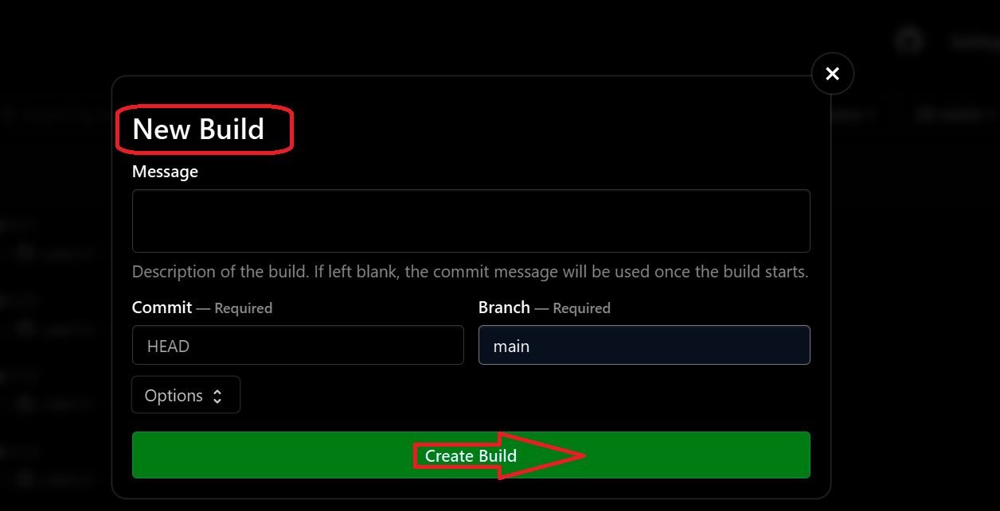
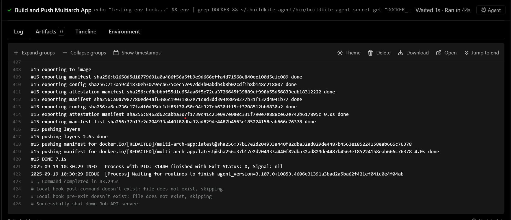
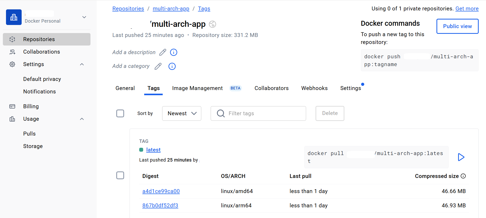

## Running Your Buildkite Pipeline for Multi-Arch Builds

Follow these steps to run your pipeline on an ARM-based Buildkite agent.

## Ensure the Agent is Running

Check that your agent is online and connected to Buildkite:

```console
# If running manually
~/.buildkite-agent/bin/buildkite-agent start

# Or if using systemd
sudo systemctl start buildkite-agent
sudo systemctl status buildkite-agent
```

## Push Your Repo Changes
Make sure your repo (with Dockerfile, app.py, and pipeline.yml) is pushed to GitHub

```console
git add .
git commit -m "Add multiarch Dockerfile and pipeline"
git push origin main
```
## Trigger the Pipeline

Trigger via Buildkite UI

- Open your pipeline in Buildkite → **Pipeline page**
- Click **“New Build”**  
- Select branch → **Start Build**



## Monitor the Build

In the Buildkite UI, you can see logs live.
Your steps (like Docker login, Buildx creation, and multi-arch build) will run on the buildkite-queue1 agent.



## Verify Multi-Arch Image

Once the build completes:



```console
docker pull <DOCKER_USERNAME>/multi-arch-app:latest
docker run --rm -p 5000:5000 <DOCKER_USERNAME>/multi-arch-app:latest
```

Then visit:

```console
http://<VM_IP>:5000/
```


