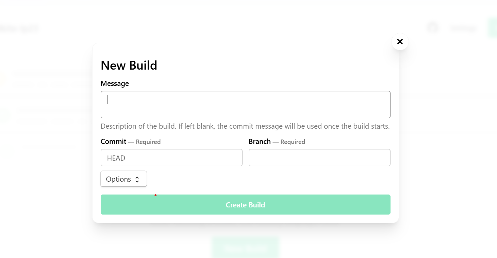
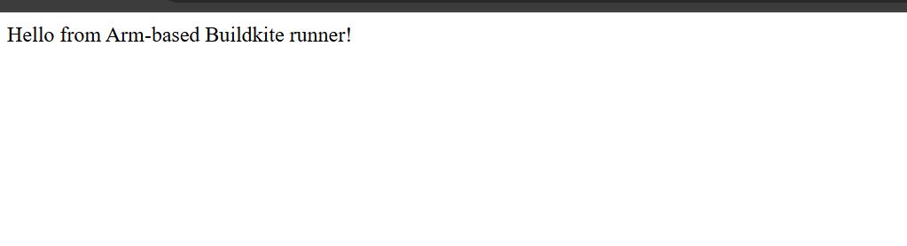

## Running Your Buildkite Pipeline for Multi-Arch Builds

Follow these steps to run your pipeline on an Arm-based Buildkite agent.

### Ensure the Agent is Running

Before your pipeline can execute, the Buildkite agent must be running and connected to your Buildkite account:

```console
# If running manually
sudo /root/.buildkite-agent/bin/buildkite-agent start

# Or if using systemd
sudo systemctl start buildkite-agent
sudo systemctl status buildkite-agent
```
- The agent listens for jobs from Buildkite and executes your pipeline steps.
- Using `systemctl` ensures the agent starts automatically on VM boot.
- You should see logs showing “Registered agent” to confirm it’s online.

### Push Your Repo Changes
Before triggering the pipeline, your GitHub repository should have:

- `Dockerfile` (defines your multi-arch image)
- `app.py` (your Python microservice)

```console
git add .
git commit -m "Add multiarch Dockerfile"
git push origin main
```
### Trigger the Pipeline

Trigger via Buildkite UI

- Open your pipeline in Buildkite → **Pipeline page**
- Click **“New Build”**  
- Select branch → **Start Build**



- Triggering the pipeline tells Buildkite to start running the steps you defined in your YAML file.
- The pipeline steps will run on the ARM-based agent you set up.

### Monitor the Build

You can see the logs of your build live in the Buildkite UI.
Steps include:

- Docker login
- Buildx builder creation
- Multi-arch Docker image build and push


### Verify Multi-Arch Image

After the pipeline completes successfully, you can go to Docker Hub and verify the pushed multi-arch images:


```console
http://<VM_IP>
```
You should see output similar to:



Your pipeline is working, and you have successfully built and deployed the multi-arch Docker image using your Arm-based Buildkite agent.
