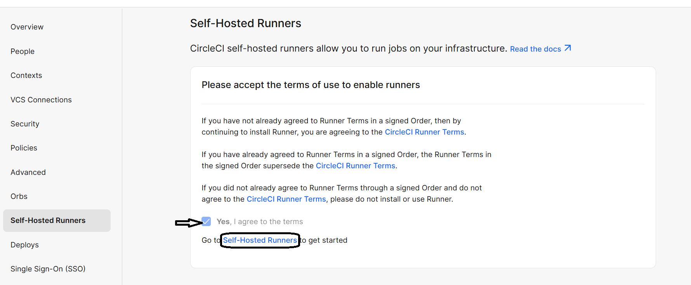
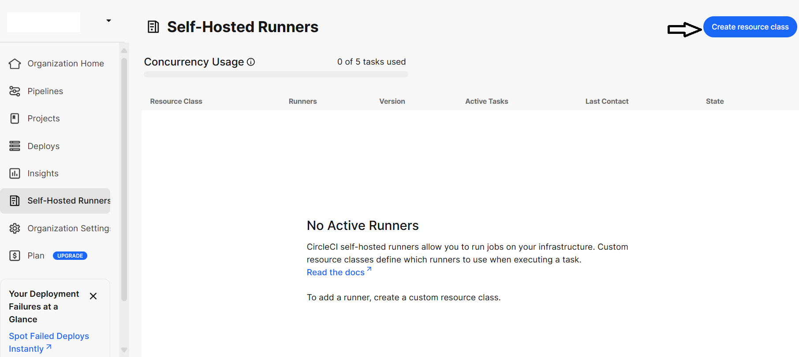
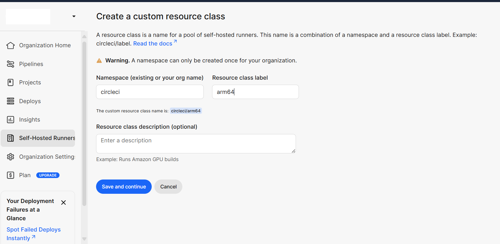
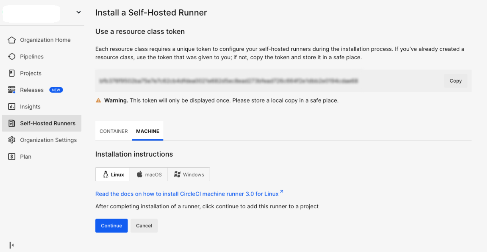

## Create a Resource Class for Self-Hosted Runner in CircleCI
This guide explains how to create a **Resource Class** in the **CircleCI Web Dashboard** for a **self-hosted runner**.  
A Resource Class defines a unique identifier for your runner and links it to your CircleCI namespace, allowing CircleCI jobs to target your custom machine environment.

### Steps

1. **Go to the CircleCI Web Dashboard**
   - Navigate to **Self-Hosted Runners** in the sidebar.

2. **Create a New Resource Class**
   - Click **Create Resource Class**.

3. **Fill in the Details**
   - **Namespace:** Your CircleCI username or organization (e.g., `circleci`)  
   - **Resource Class Name:** A descriptive name for your runner, such as `arm64-medium`

4. **Save and Copy the Token**
   - Once created, CircleCI will generate a **Resource Class Token**.  
   - Copy this token and store it securely — you will need it to register your runner on the GCP VM.

   
