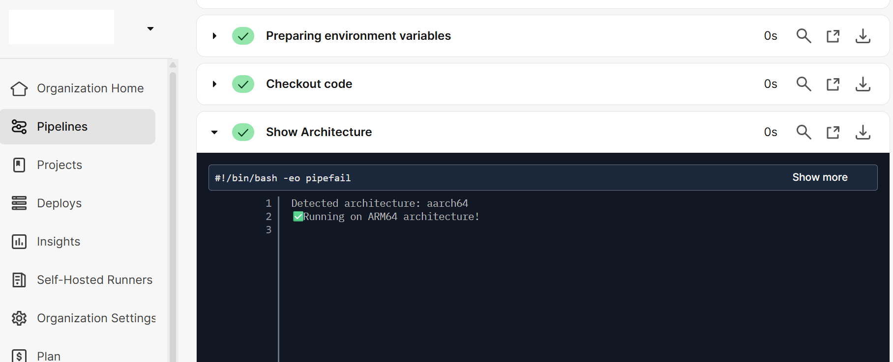
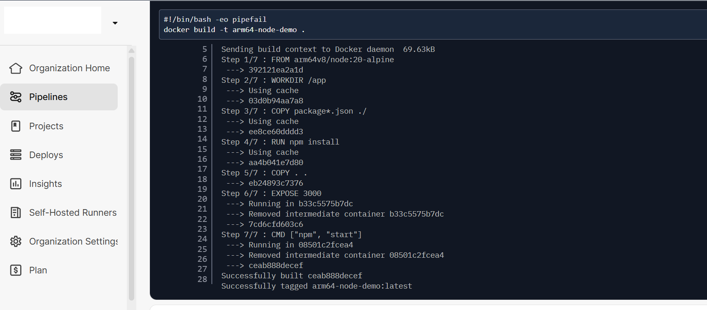
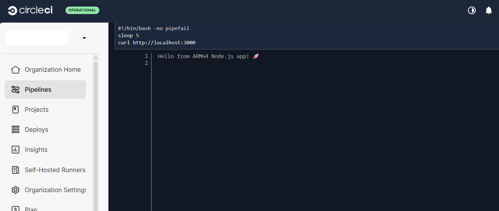

## Deploying a Cloud-Native ARM64 Node.js App using self-hosted CircleCI Runner on GCP

This guide walks through building and testing a simple **Node.js web app** using a **self-hosted CircleCI Arm64 runner** on a **GCP SUSE Arm64 VM**.


### Install and Configure Docker
Ensure Docker is installed, started, and accessible to both your user and the CircleCI runner service:

```console
sudo zypper refresh
sudo zypper install docker
sudo systemctl enable docker
sudo systemctl start docker
sudo systemctl status docker
sudo usermod -aG docker $USER
sudo usermod -aG docker circleci
sudo systemctl restart circleci-runner
```
**Validate Docker access:**

```console
sudo -u circleci -i
docker ps
exit
```

### Verify Docker Permissions
Check Docker socket permissions and confirm CircleCI runner is active:

```console
ls -l /var/run/docker.sock
ps -aux | grep circleci-runner
```

### Clone Your App Repository
Clone your application repository (or create one locally):

```console
git clone https://github.com/<your-repo>/arm64-node-demo.git
cd arm64-node-demo
```

### Create a Dockerfile

```dockerfile
# Dockerfile
FROM arm64v8/node:20-alpine
WORKDIR /app
COPY package*.json ./
RUN npm install
COPY . .
EXPOSE 3000
CMD ["npm", "start"]
```

### Add a CircleCI Configuration
Create .circleci/config.yml:

```yaml
version: 2.1

jobs:
  arm64-demo:
    machine: true
    resource_class: <Your_resource_class>
    steps:
      - checkout
      - run:
          name: Show Architecture
          command: |
            ARCH=$(uname -m)
            echo "Detected architecture: $ARCH"
            if [ "$ARCH" = "aarch64" ]; then
              echo "✅ Running on ARM64 architecture!"
            else
              echo "Not running on ARM64!"
              exit 1
            fi
      - run:
          name: Build Docker Image
          command: docker build -t arm64-node-demo .
      - run:
          name: Run Docker Container
          command: docker run -d -p 3000:3000 arm64-node-demo
      - run:
          name: Test Endpoint
          command: |
            sleep 5
            curl http://localhost:3000

workflows:
  version: 2
  arm64-workflow:
    jobs:
      - arm64-demo
```

### Node.js Application

`index.js`

```javascript
const express = require('express');
const app = express();
const PORT = process.env.PORT || 3000;

app.get('/', (req, res) => {
  res.send('Hello from ARM64 Node.js app! 🚀');
});

app.listen(PORT, () => {
  console.log(`Server running on port ${PORT}`);
});
```
package.json

```json
{
  "name": "arm64-node-demo",
  "version": "1.0.0",
  "main": "index.js",
  "scripts": {
    "start": "node index.js",
    "test": "echo \"No tests yet\""
  },
  "dependencies": {
    "express": "^4.18.2"
  }
}
```
### Push Code to GitHub

Once all files (`Dockerfile`, `index.js`, `package.json`, `.circleci/config.yml`) are ready, push your project to GitHub so CircleCI can build it automatically.

```console
git add .
git commit -m "Add ARM64 CircleCI Node.js demo project"
git push -u origin main
```
### Start CircleCI Runner and Execute Job

```console
sudo systemctl enable circleci-runner
sudo systemctl start circleci-runner
sudo systemctl status circleci-runner
```

After pushing your code to GitHub, open your **CircleCI Dashboard → Projects**, and confirm that your **ARM64 workflow** starts running using your **self-hosted runner**.

If the setup is correct, you’ll see your job running under the resource class you created.

### Output
If successful, CircleCI will detect the Arm64 architecture, build your Docker image, and return:






