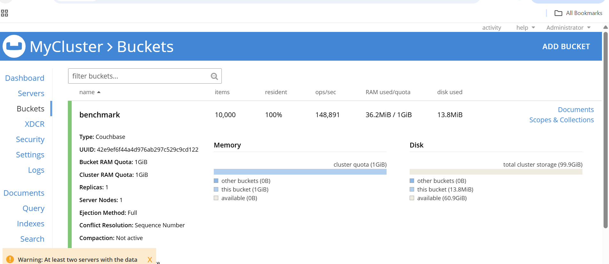

##  Puppet Benchmark on GCP SUSE Arm64 VM

### Install Build Tools & Dependencies

```console
sudo zypper install -y gcc gcc-c++ cmake make git openssl-devel libevent-devel cyrus-sasl-devel
```

### Download and Build the Couchbase C SDK (includes cbc-pillowfight)

```console
cd ~
git clone https://github.com/couchbase/libcouchbase.git
cd libcouchbase
```
### Update the Dynamic Linker Configuration
Tell the OS where to look for the library:

```console
echo "/usr/local/lib" | sudo tee /etc/ld.so.conf.d/libcouchbase.conf
```

Then refresh the linker cache:

```console
sudo ldconfig
```

### Verify Installation
After installation, the tools like **cbc**, **cbc-pillowfight**, etc. should be available in `/usr/local/bin`.

**Verify with:**

```console
cbc --version
cbc-pillowfight --help
```

### Run Benchmark using cbc-pillowfight
Once Couchbase Server is running and a bucket (e.g., `benchmark`) is created, you can run a workload test using the following command:

```console
cbc-pillowfight -U couchbase://127.0.0.1/benchmark \
-u Administrator -P password \
-I 10000 -B 1000 -t 5 -c 500
```

- **-U couchbase://127.0.0.1/benchmark**: Connection string to Couchbase bucket
- **-u Administrator**:	Couchbase username
- **-P password**: Couchbase password
- **-I 10000**:	Number of items (documents) to use
- **-B 1000**: Batch size for operations
- **-t 5**:	Number of concurrent threads
- **-c 500**:	Number of operation cycles to run

### Monitoring During Test
While running `cbc-pillowfight`, open the Couchbase Web UI at:

```bash
http://<your-vm-ip>:8091
```

Go to:
**Dashboard → Buckets → benchmark → Metrics tab**

Watch these in real time:
- **Ops/sec** — should match your CLI output (~400k)
- **Resident ratio** — how much data stays in memory
- **Disk write queue** — backlog of writes to disk
- **CPU and memory usage** — tells you how well ARM cores are handling load


