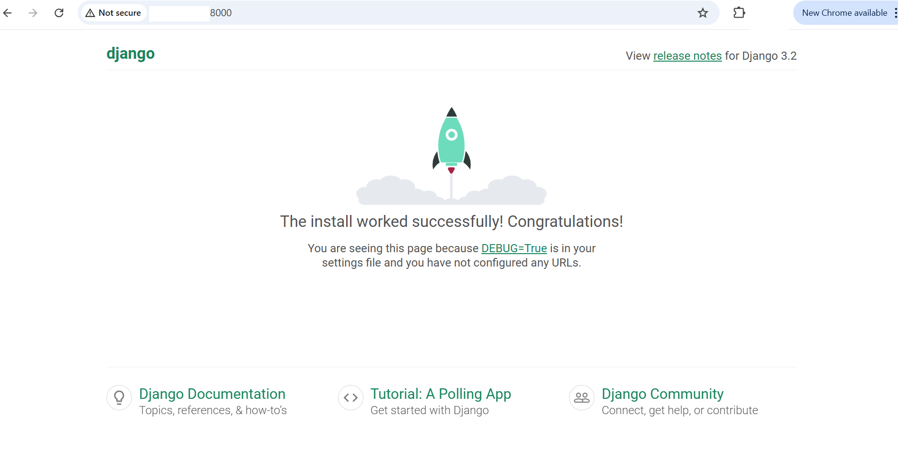

## Django Baseline Testing on GCP SUSE VMs

### Baseline 1 — View Django Welcome Page
This verifies that Django is installed and your web server runs properly.

#### Activate your Python environment
If already created:

```console
source myenv/bin/activate
```

#### Create a new Django project

```console
django-admin startproject myproject
cd myproject
```

This creates:

```markdown
myproject/
├── manage.py
└── myproject/
    ├── settings.py
    ├── urls.py
    ├── asgi.py
    └── wsgi.py
```

#### Run initial migrations

```console
python manage.py migrate
```

#### Start the Django development server
Before starting the Django development server, you must configure your ALLOWED_HOSTS setting to allow access from your VM’s external IP.
This ensures that Django accepts HTTP requests from outside the localhost (e.g., when testing in a browser or from another machine).

- Navigate to Your Project Settings
  Move into your Django project directory where the settings.py file is located.

  ```console
  cd ~/myproject/mysite/mysite
  ```

- Open settings.py File
  Use any text editor (like vi or nano) to open the file.

  ```console
  vi settings.py
  ```
  
- Locate the `ALLOWED_HOSTS` Line
  Inside the file, find the following line:

   ```python
  ALLOWED_HOSTS = []
  ```
 This setting defines which host/domain names Django will serve.

- Allow All Hosts (for Testing Only)
  To make your Django app accessible from your VM’s external IP address, update it to:
  ```pthon
  ALLOWED_HOSTS = ['*']
  ```
{}
Allowing all hosts `('*')` is suitable **only for development or testing**.
For production, replace `'*'` with specific domain names or IPs, such as:
{}

```python
ALLOWED_HOSTS = ['your-external-ip', 'your-domain.com']
```

**Now start the Django development server:**

```console
python manage.py runserver 0.0.0.0:8000
```

#### View in browser
Open a web browser on your local machine (Chrome, Firefox, Edge, etc.) and enter the following URL in the address bar:

```console
http://<YOUR_VM_EXTERNAL_IP>:8000
```
- Replace `<YOUR_VM_EXTERNAL_IP>` with the public IP of your GCP VM.

If everything is set up correctly, you should see the default Django welcome page (“The install worked successfully!”). It looks like this:


