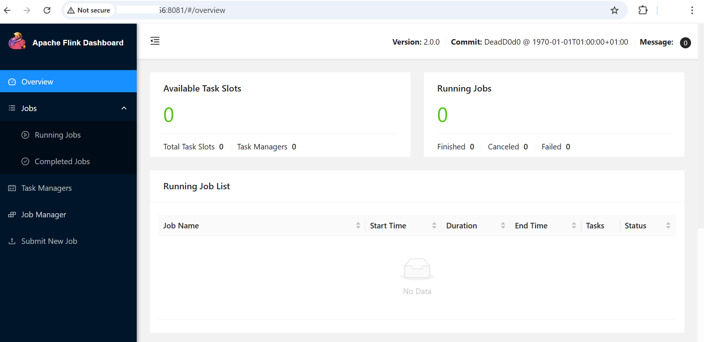

## Apache Flink Baseline Testing on GCP SUSE VM

This guide outlines the baseline testing steps for Apache Flink after installation on a SUSE Arm64 VM.

### Start the Flink Cluster
Start the Flink cluster using the following command:

```console
cd $FLINK_HOME
./bin/start-cluster.sh
```

You should see output similar to:
```output
Starting cluster.
[INFO] 1 instance(s) of standalonesession are already running on lpprojectsusearm64.
Starting standalonesession daemon on host lpprojectsusearm64.
Starting taskexecutor daemon on host lpprojectsusearm64.
```

Verify that the JobManager and TaskManager processes are running:

```console
jps
```

You should see output similar to:
```output
21723 StandaloneSessionClusterEntrypoint
2621 Jps
2559 TaskManagerRunner
```

### Access the Flink Web UI

Open the Flink Web UI in a browser:

```console
http://<VM_IP>:8081
```

- If the Dashboard loads successfully, the cluster network and UI are verified.
- This serves as the baseline for network and UI access.



### Run a Simple Example Job

Execute a sample streaming job to confirm runtime functionality:

```console
cd $FLINK_HOME
./bin/flink run examples/streaming/WordCount.jar
```

- Monitor the job in the Web UI or check console logs.
- Confirm that the job completes successfully.


