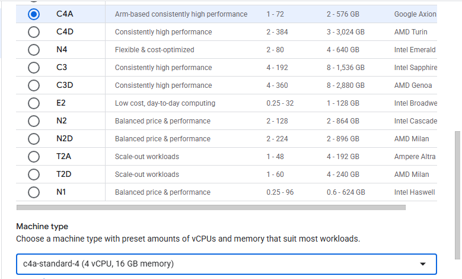

## Introduction

Google Cloud Platform (GCP) provides Arm-based virtual machines through its **C4A series**, powered by **Neoverse-V2 CPUs**. These VMs are optimized for performance and cost-efficiency, especially for compute-intensive workloads.

This guide walks you through provisioning an **Arm64 VM** on GCP using the **Google Cloud Console**, specifically selecting from the **C4A general-purpose instance family**.

If you are new to Google Cloud, it's recommended to follow the [GCP Quickstart Guide to Create a VM](https://cloud.google.com/compute/docs/instances/create-start-instance).

### Create an Arm-based Virtual Machine (C4A)

To create a VM based on the C4A Arm architecture:
1. Navigate to the [Google Cloud Console](https://console.cloud.google.com/).
2. Go to **Compute Engine > VM Instances** and click **“Create Instance”**.
3. Fill in basic details like **Instance Name**, **Region**, and **Zone**.
4.Under the **Machine Configuration**:
   - Set **Architecture** to `Arm64`.
   - Choose the **Series** as `C4A`.
   - Select a machine type such as `c4a-standard-4`.

5. Under **Boot disk**, choose an image like **Ubuntu 24.04 LTS (Arm64)**.

6. Enable **Allow HTTP traffic** to test workloads like NGINX later.

Click **Create**, and the instance will launch.

