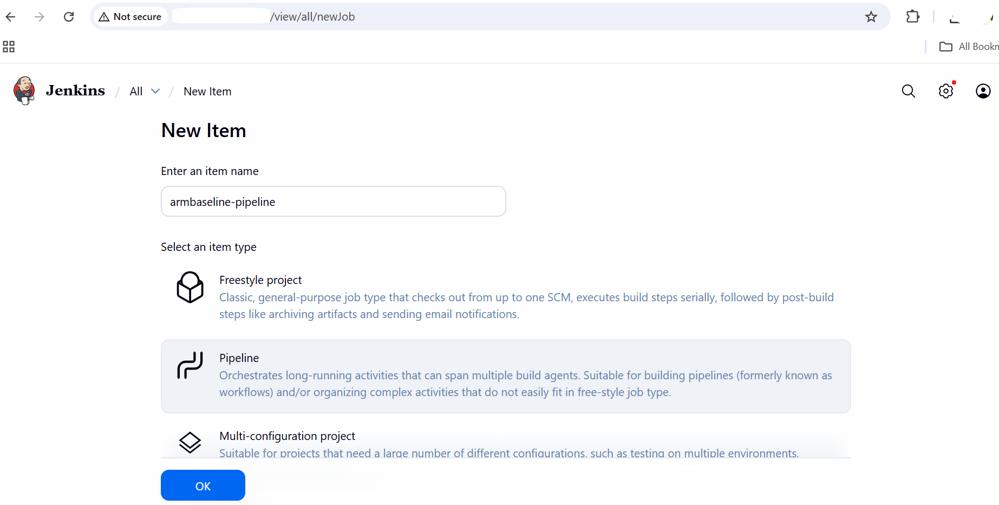
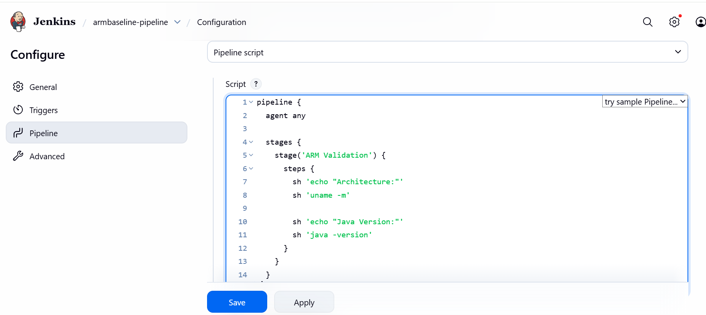
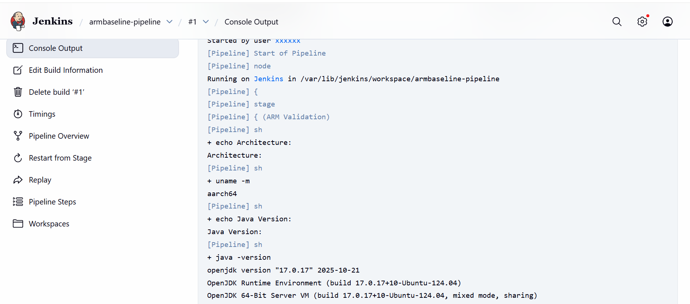

## Jenkins Baseline Validation on Azure Ubuntu Arm64
This document validates a **working Jenkins LTS setup** on an **Azure Ubuntu 24.04 Arm64 VM** after installation is complete.
It focuses on **service health, network access, ARM verification, and a first pipeline run**.

### Network Verification
Ensure Jenkins is listening on port **8080** and that the port is allowed at both the Azure and VM levels.

### Verify Jenkins is listening on port 8080

```console
ss -lntp | grep 8080
```

Expected output indicates Jenkins is listening:
```output
LISTEN 0 50 *:8080 *:*
```

### Azure Network Security Group (NSG)
Confirm the following inbound rule exists in the Azure portal:

* **Port**: 8080
* **Protocol**: TCP
* **Action**: Allow
* **Source**: Internet (or your IP range)

### Retrieve Initial Admin Password

```console
sudo cat /var/lib/jenkins/secrets/initialAdminPassword
```

Copy the password.

### Access Jenkins UI

Open Jenkins in your local browser:

```text
http://<VM_PUBLIC_IP>:8080
```

Example:

```text
http://<VM_PUBLIC_IP>:8080
```

### Complete UI Setup
Follow the on-screen steps:

1. Paste the initial admin password
2. Select **Install suggested plugins**
3. Create an admin user
4. Finish setup and reach the Jenkins dashboard

### Baseline Verification (ARM)

### Verify Jenkins User and Home Directory

```console
id jenkins
ls -ld /var/lib/jenkins
```

### Verify Jenkins Process

```console
ps -ef | grep jenkins
```

### Verify ARM Architecture

```console
uname -m
```

Expected output:

```text
aarch64
```

### Execute Your First Jenkins Pipeline
This section confirms Jenkins can run jobs successfully on ARM.

### Step 1: Open Jenkins Dashboard

Navigate to:

```text
http://<VM_PUBLIC_IP>:8080
```

Log in using your Jenkins credentials.

### Step 2: Create a New Pipeline Job

1. Click **New Item** (left sidebar)
2. Enter item name:

```text
arm-baseline-pipeline
```

3. Select **Pipeline**
4. Click **OK**



### Step 3: Add the Pipeline Script

Scroll to the **Pipeline** section.

* **Definition**: Pipeline script

Paste the following script:

```groovy
pipeline {
  agent any

  stages {
    stage('ARM Validation') {
      steps {
        sh 'echo "Architecture:"'
        sh 'uname -m'

        sh 'echo "Java Version:"'
        sh 'java -version'
      }
    }
  }
}
```

Click **Save**.



### Step 4: Run the Pipeline

1. On the job page, click **Build Now**
2. A build number will appear under **Build History**

### Step 5: View Console Output

1. Click the build number (for example, `#1`)
2. Click **Console Output**



### Baseline Validation Result

Successful execution confirms:

* Jenkins LTS is running correctly
* Java 17 is properly configured
* Jenkins jobs execute natively on ARM64

### Baseline Summary

This baseline validates a successful Jenkins LTS setup on Azure Ubuntu Arm64 using Java 17. Service health, UI accessibility, system verification, and ARM-native pipeline execution are confirmed.
The system is now ready for CI/CD workloads on Arm architecture.
