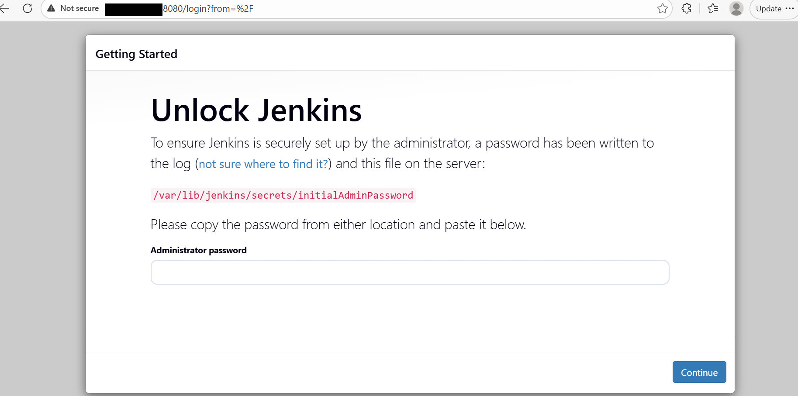
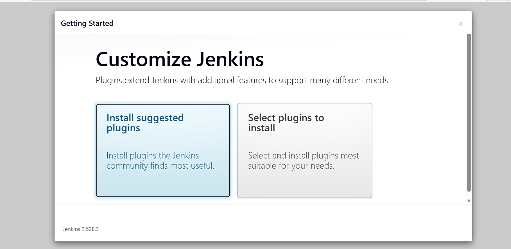
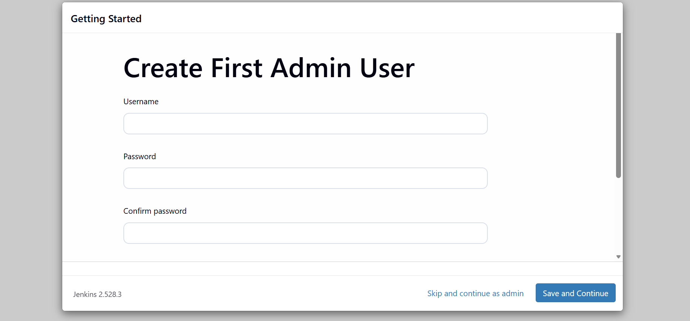
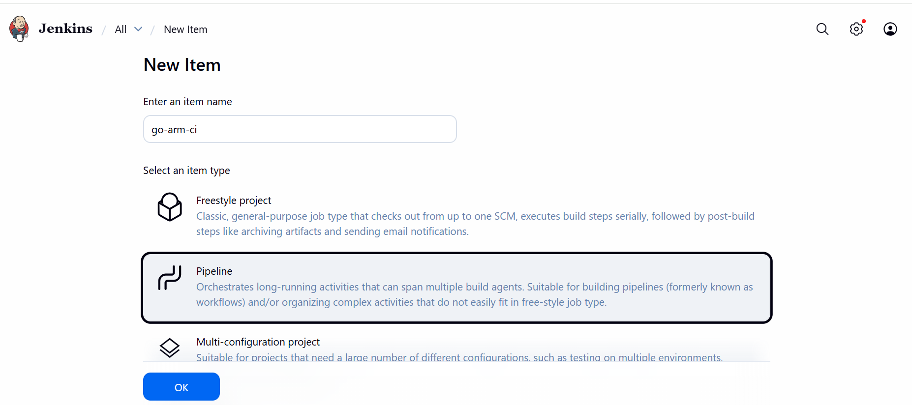
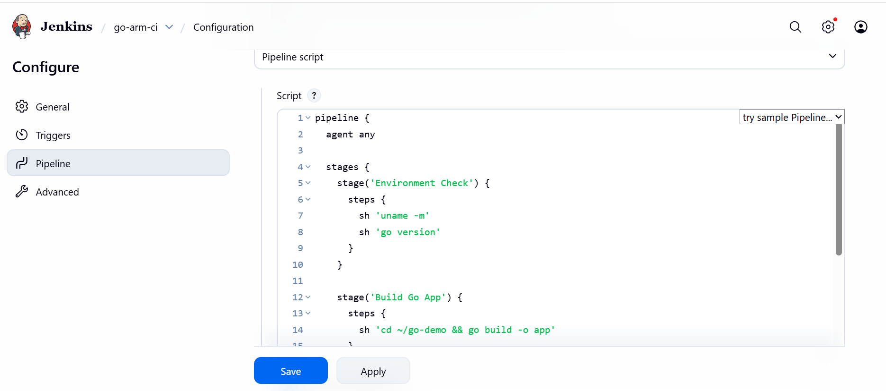
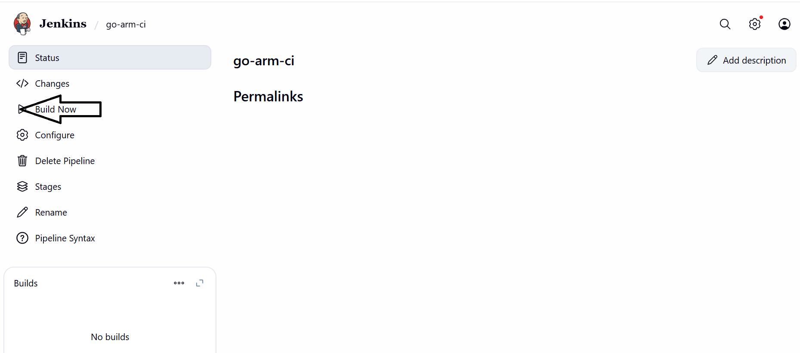

## Jenkins Use Case - Arm-Native Go CI Pipeline on Jenkins (GCP SUSE Arm64)
This use case demonstrates how to validate **ARM-native CI execution** on a **GCP SUSE Arm64 VM** using Jenkins.
A simple Go application is built and executed to confirm that Jenkins, Go, and the underlying system are running natively on **aarch64**.

### Network Verification
Ensure Jenkins is listening on port **8080** and accessible.

```console
ss -lntp | grep 8080
```

Expected output includes:

```output
LISTEN 0 50 *:8080 *:*
```

Verify that the firewall (if enabled) allows port 8080 and that the GCP firewall rule permits inbound traffic on this port.


### Retrieve Initial Admin Password
This step retrieves the automatically generated Jenkins administrator password required for first-time login.

```console
sudo cat /var/lib/jenkins/secrets/initialAdminPassword
```

Copy and securely store this password for UI access.

### Access Jenkins UI
This step confirms browser-based access to the Jenkins web interface.

**Open Jenkins in a local browser:**

```text
http://<VM_PUBLIC_IP>:8080
```

### Complete UI Setup
Complete the initial Jenkins setup using the web interface.

1. Paste the initial admin password



2. Select **Install suggested plugins**



3. Create an admin user



4. Finish setup and reach the Jenkins dashboard

### Prepare Go Application on the VM

#### Install Go

```console
sudo zypper install -y go
```

Verify Go installation:

```console
go version
```

Expected output:

```output
go version go1.x.x linux/arm64
```

#### Create a Sample Go Application

```console
mkdir -p ~/go-demo
cd ~/go-demo
```

Create `main.go`:

```console
cat <<EOF > main.go
package main

import "fmt"

func main() {
    fmt.Println("Hello from Go on ARM64 via Jenkins")
}
EOF
```

Initialize Go module:

```console
go mod init go-demo
```

Test locally:

```console
go run main.go
```

### Create Jenkins Pipeline Job

#### Step 1: Create New Job

* Open Jenkins UI
* Click **New Item**
* Job name: `go-arm-ci`
* Select **Pipeline**
* Click **OK**



#### Step 2: Configure Pipeline Script

Scroll to the **Pipeline** section and select:

**Definition:** Pipeline script

Paste the following script:

```groovy
pipeline {
  agent any

  stages {
    stage('Environment Check') {
      steps {
        sh 'uname -m'
        sh 'go version'
      }
    }

    stage('Build Go App') {
      steps {
        sh '''
          cd $WORKSPACE
          cp -r /home/gcpuser/go-demo .
          cd go-demo
          go build -o app
        '''
      }
    }

    stage('Run Binary') {
      steps {
        sh '''
          cd $WORKSPACE/go-demo
          ./app
        '''
      }
    }
  }
}
```

Click **Save**.



#### Step 3: Run the Pipeline

* On the job page, click **Build Now**
* Click the build number
* Open **Console Output**



#### Step 4: View Console Output
Review the pipeline logs to confirm successful execution.

1. Click the build number (for example, `#1`)
2. Click **Console Output**


### Validation Criteria

This use case confirms:

* Jenkins jobs execute successfully on Arm64
* Go toolchain runs natively on aarch64
* Jenkins workspace and filesystem handling are correct
* End-to-end CI execution works on GCP SUSE Arm64

### Use Case Summary

This use case validates an ARM-native Jenkins CI pipeline by building and executing a Go application on a GCP SUSE Arm64 VM.
It confirms correct Jenkins configuration, Go module handling, and native ARM execution suitable for cloud-native CI workloads.
