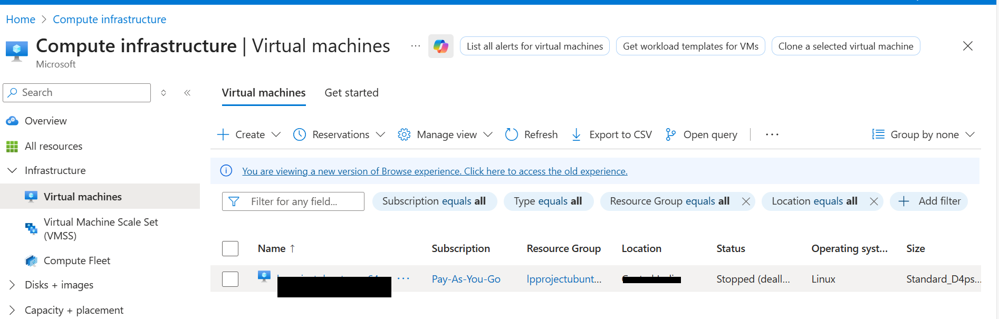
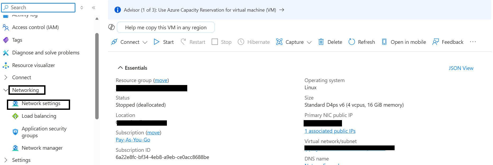
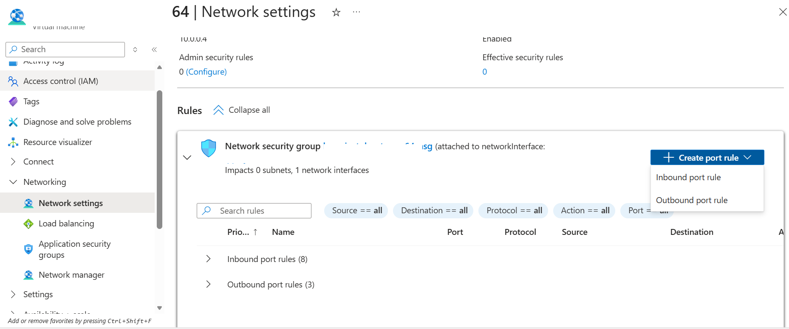

## Overview
In this section, you create a Firewall Rule within the Microsoft Azure Console to expose TCP port 8080.

To allow external traffic on port **8080** for your application running on an Azure Virtual Machine, you must open the port in the **Network Security Group (NSG)** attached to the VM's network interface or subnet.

{}
For support on GCP setup, see the Learning Path [Getting started with Google Cloud Platform](/learning-paths/servers-and-cloud-computing/csp/google/).
{}

### Identify the VM and its NSG

To expose the TCP port 8080, create a firewall rule.

Navigate to the [Azure Portal]([https://console.cloud.google.com/](https://portal.azure.com)), go to ****Virtual Machines**, and select **your VM**.

Next, in the left menu, click **Networking** and in the **Networking** select **Network settings** that is associated with the VM's network interface.

### Create an Inbound Rule for Port 8080
Navigate to **Create port rule**, select **Inbound port rule**, and configure it using the following details. After filling in the details, click **Add** to save the rule.

The network firewall rule is now created
