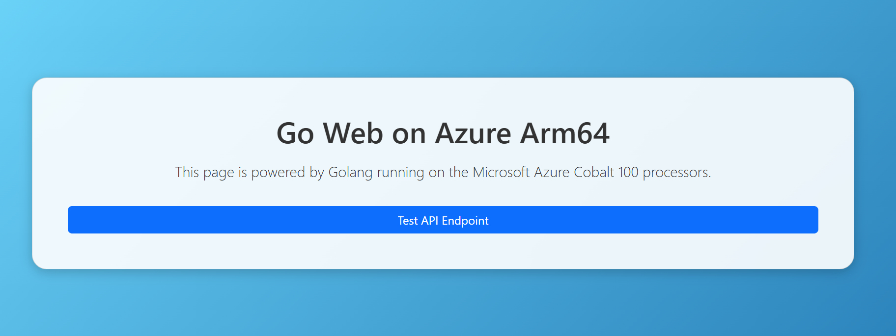

### Baseline testing of Golang Web Page on Azure Arm64
This guide demonstrates how to test your Go installation on Azure Arm64 by creating and running a simple Go web server that serves a styled HTML page.

**1. Create Project Directory**

First, create a new folder called goweb to hold your project and move inside it:

```console
mkdir goweb && cd goweb
```
This makes a directory named goweb and then changes into it.

**2. Create HTML Page with Bootstrap Styling**

Next, create a file named `index.html` using the nano editor:

```console
nano index.html
```

Paste the following HTML code inside. This builds a simple, styled web page with a header, a welcome message, and a button using Bootstrap.

```html
<!DOCTYPE html>
<html lang="en">
<head>
    <meta charset="UTF-8">
    <meta name="viewport" content="width=device-width, initial-scale=1.0">
    <title>Go Web on Azure ARM64</title>
    <link href="https://cdn.jsdelivr.net/npm/bootstrap@5.3.2/dist/css/bootstrap.min.css" rel="stylesheet">
    <style>
        body {
            background: linear-gradient(135deg, #6dd5fa, #2980b9);
            color: white;
            min-height: 100vh;
            display: flex;
            align-items: center;
            justify-content: center;
            text-align: center;
        }
        .card {
            background: rgba(255, 255, 255, 0.9);
            color: #333;
            border-radius: 20px;
            box-shadow: 0 4px 15px rgba(0,0,0,0.2);
        }
    </style>
</head>
<body>
    <div class="container">
        <div class="card p-5">
            <h1 class="mb-3"> Go Web on Azure Arm64</h1>
            <p class="lead">This page is powered by Golang running on the Microsoft Azure Cobalt 100 processors.</p>
            <a href="/api/hello" class="btn btn-primary mt-3">Test API Endpoint</a>
        </div>
    </div>
</body>
</html>
```
**3. Create Golang Web Server**

Now create the Go program that will serve this web page:

```console
nano main.go
```
Paste the code below. This sets up a very basic web server that serves files from the current folder, including the **index.html** you just created. When it runs, it will print a message showing the server address.

```go
package main
import (
    "encoding/json"
    "log"
    "net/http"
    "time"
)
func main() {
    // Serve index.html for root
    http.HandleFunc("/", func(w http.ResponseWriter, r *http.Request) {
        if r.URL.Path == "/" {
            http.ServeFile(w, r, "index.html")
            return
        }
        http.FileServer(http.Dir(".")).ServeHTTP(w, r)
    })
    // REST API endpoint for JSON response
    http.HandleFunc("/api/hello", func(w http.ResponseWriter, r *http.Request) {
        w.Header().Set("Content-Type", "application/json")
        json.NewEncoder(w).Encode(map[string]string{
            "message": "Hello from Go on Azure ARM64!",
            "time":    time.Now().Format(time.RFC1123),
        })
    })
    log.Println("Server running on http://0.0.0.0:80")
    log.Fatal(http.ListenAndServe(":80", nil))
}
```

**4. Run the Web Server**

Run your Go program with:

```console
go run main.go
```

This compiles and immediately starts the server. If successful, you’ll see the message:

```output
2025/08/19 04:35:06 Server running on http://0.0.0.0:80
```
**5. Open in Browser**

Finally, open your web browser and type in:

```bash
http://< <Public-IP> >:8080
```
Replace <**Public-IP**> with your Azure virtual machine’s actual public IP address. When you visit this link, you should see the styled HTML page being served directly by your Go application.

You should see the Golang web page confirming a successful installation of Golang.



Replace <**Public-IP**> with your Azure virtual machine’s actual public IP address. When you visit this link, you should see the styled HTML page being served directly by your Go application.

Now, your Golang instance is ready for further benchmarking and production use.
