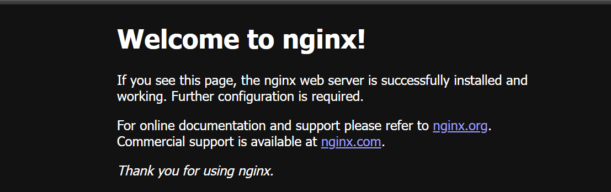

## Nginx Installation on Azure Ubuntu Pro 24.04 LTS

Install Nginx using `apt` on your Azure Ubuntu Pro 24.04 LTS virtual machine, start the Nginx service, and allow **HTTP** traffic through the firewall. Then access the default welcome page using your virtual machine’s public IP address in a browser.

### Install Nginx

```console
sudo apt update
sudo apt install -y nginx
sudo systemctl enable nginx
sudo systemctl start nginx
```

### Verify Nginx

```console
sudo systemctl status nginx
```
You should see an output similar to:

```output
● nginx.service - A high performance web server and a reverse proxy server
     Loaded: loaded (/usr/lib/systemd/system/nginx.service; enabled; preset: enabled)
     Active: active (running) since Mon 2025-09-08 04:26:39 UTC; 20s ago
       Docs: man:nginx(8)
   Main PID: 1940 (nginx)
      Tasks: 5 (limit: 19099)
     Memory: 3.6M (peak: 8.1M)
        CPU: 23ms
     CGroup: /system.slice/nginx.service
             ├─1940 "nginx: master process /usr/sbin/nginx -g daemon on; master_process on;"
             ├─1942 "nginx: worker process"
             ├─1943 "nginx: worker process"
             ├─1944 "nginx: worker process"
             └─1945 "nginx: worker process"
```
Also, you can use the below command to see the installed version of Nginx:

```console
nginx -v
```
{}
There is an [Arm community blog](https://community.arm.com/arm-community-blogs/b/servers-and-cloud-computing-blog/posts/improve-nginx-performance-up-to-32-by-deploying-on-alibaba-cloud-yitian-710-instances) that shows that NGINX version 1.20.1 deployed on Yitian 710 based ECS provides up to 32% more throughput in compared to the equivalent x86 based ECS instances.
 
The [Arm Ecosystem Dashboard](https://developer.arm.com/ecosystem-dashboard/) recommends Nginx version 1.20.1 as the minimum recommended on the Arm platforms.
{}

### Validation with curl
Validation with `curl` confirms that Nginx is correctly installed, running, and serving **HTTP** responses.

Run the following command to send a HEAD request to the local Nginx server:
```console
curl -I http://localhost/
```
The `curl -I http://localhost/` command sends a HEAD request to Nginx to check its **HTTP** response headers without downloading the page content.

You should see an output similar to:

```output
HTTP/1.1 200 OK
Server: nginx/1.24.0 (Ubuntu)
Date: Mon, 08 Sep 2025 04:27:20 GMT
Content-Type: text/html
Content-Length: 615
Last-Modified: Mon, 08 Sep 2025 04:26:39 GMT
Connection: keep-alive
ETag: "68be5aff-267"
Accept-Ranges: bytes
```

Output summery:
- **HTTP/1.1 200 OK**: Nginx is responding successfully.
- **Server: nginx/1.24.0**: Confirms it's running Nginx.
- Confirms your web server is reachable on **localhost**.

### Accessing the Nginx Default Page

You can access the Nginx default page from your Virtual machine’s public IP. Run the following command to display your public URL:

Now you can access the NGINX default page in a browser. Run the following command to print your VM’s public URL, then open it in a browser:
```console
echo "http://$(curl -s ifconfig.me)/"
```

Open the printed URL in a browser. You should see the Nginx welcome page confirming a successful installation.



Nginx installation is complete. You can now proceed with the baseline testing ahead.
