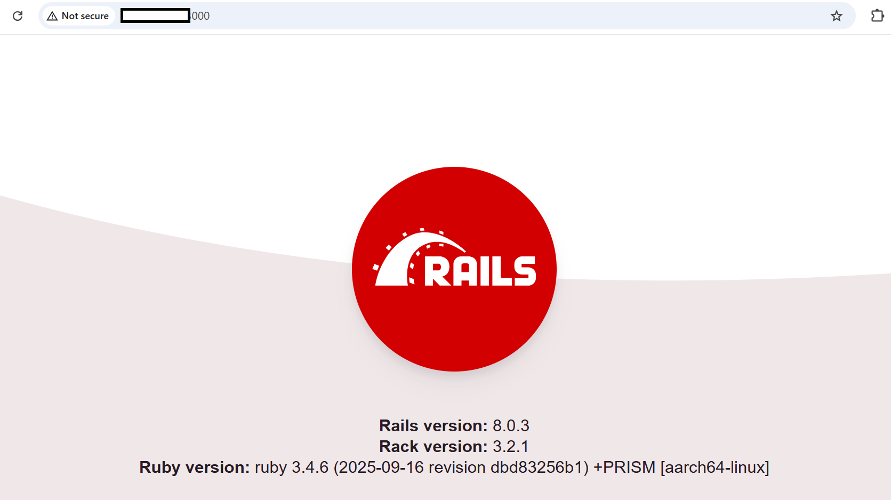

## Baseline Setup for Rails with PostgreSQL
This section covers the installation and configuration of **PostgreSQL** and a **Rails application** on a SUSE Arm-based GCP VM. It includes setting up PostgreSQL, creating a Rails app, configuring the database, and starting the Rails server.

###  Install and Configure PostgreSQL

```console
sudo zypper install postgresql-devel postgresql-server
sudo systemctl start postgresql
sudo systemctl enable postgresql
```
- `postgresql-devel` is required to compile the pg gem for Rails.
- Ensure the PostgreSQL service is running:

```console
systemctl status postgresql
```

This command creates a new PostgreSQL role (user) named `gcpuser` with **superuser privileges**.  

```console
sudo -u postgres createuser --superuser gcpuser
```

### Create a Rails App with PostgreSQL

```console
rails new db_test_app -d postgresql
cd db_test_app
bundle install
```
{}
Check config/database.yml and update username/password if needed.
{}
- `bundle install` ensures all required gems are installed.

### Setup Database and Scaffold

```console
rails db:create
rails generate scaffold task title:string due_date:date
rails db:migrate
```
- This creates a simple tasks table with title and due_date.

### Start Rails Server

```console
rails server -b 0.0.0.0
```
- Binding to `0.0.0.0` allows access from other machines.
- Default Rails port is `3000`. Open firewall if needed:

```console
sudo firewall-cmd --add-port=3000/tcp --permanent
sudo firewall-cmd --reload
```

### Access the Application:
Open a web browser on your local machine (Chrome, Firefox, Edge, etc.) and enter the following URL in the address bar:

```console
http://[YOUR_VM_EXTERNAL_IP]:3000.
```
- Replace `<YOUR_VM_PUBLIC_IP>` with the public IP of your GCP VM.

If everything is set up correctly, you will see a Rails welcome page in your browser. It looks like this:



This verifies the basic functionality of the Ruby/Rails installation before proceeding to the benchmarking.
